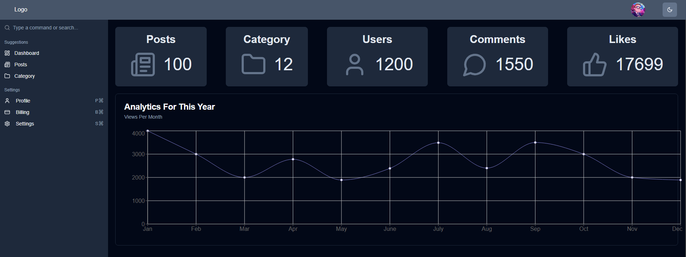
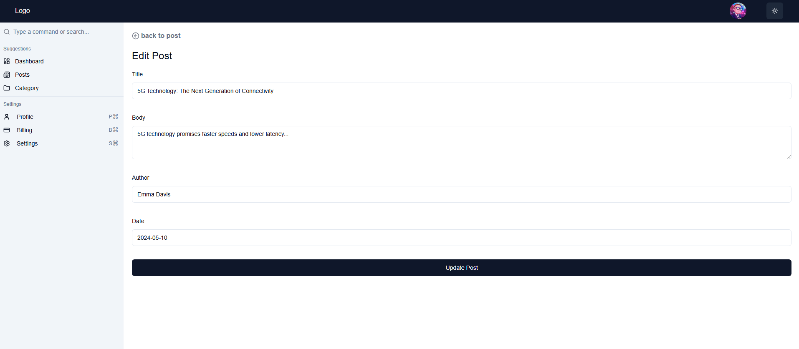
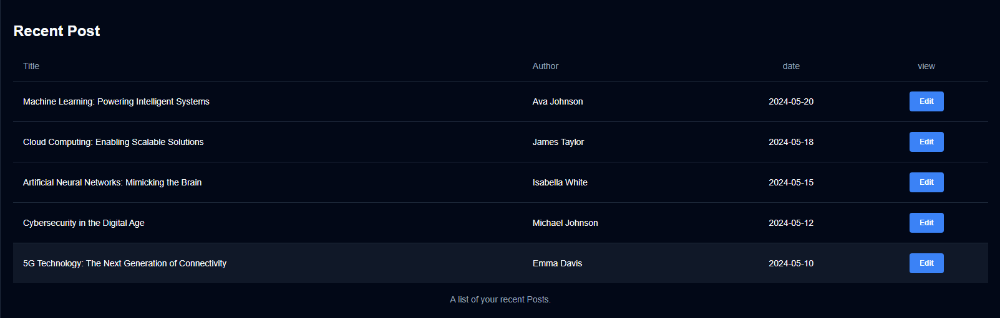

Admin Dashboard
A sleek and responsive Admin Dashboard built with Next.js, ShadCN UI, and Tailwind CSS. This project focuses on creating reusable components and a smooth user experience for data management.

Features
 
Reusable Components: Built with ShadCN for consistency.
Dark Mode: Switchable light and dark themes.
Editable Content: Easily manage posts and content.
Tech Stack
Next.js | Tailwind CSS | ShadCN UI | TypeScript
 
 
 
 
 ### Dashboard Home                                  

### Edit Post

### Recent Posts
